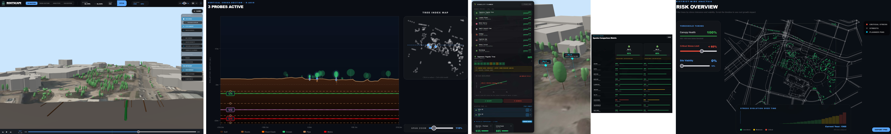

# RootScape: Visual Analytics for Subsurface-Aware Urban Tree Planning

RootScape is an interactive platform for visualizing and simulating the complex relationship between urban infrastructure and tree growth. 

**[🌐 View Live Dashboard](https://angelikigram.github.io/rootscape/)**



---

## Quick Start

### 1. Web Dashboard (React + Three.js)
The analytical interface for urban planners to visualize tree growth, soil constraints, and underground infrastructure.

**One-time Data Setup:**
To fetch local GIS data (Vienna/OSM caches):
```bash
cd rootscape
python preprocess_vienna.py
```

**Run the App:**
```bash
npm install
npm run dev --prefix rootscape
```
Open [http://localhost:5173](http://localhost:5173) in your browser.

---

### 2. Simulation Engine (Python)
The core logic driving botanical modeling and root-shoot competition.

```bash
cd rhizomorph_python
pip install -r requirements.txt
python main.py
```

### Preprocessing for local data
```bash
python dtm_fetch.py --lat 48.1995 --lon 16.3695 --half_m 350 > public/dtm_vienna_cache.json
python trees_fetch.py --lat 48.1995 --lon 16.3695 --half_m 350 > public/trees_vienna_cache.json
python underground_fetch.py --lat 48.1995 --lon 16.3695 --half_m 350 > public/underground_vienna_cache.json
python pavement_fetch.py --lat 48.1995 --lon 16.3695 --half_m 350 > public/pavements_vienna_cache.json
python soil_fetch.py --lat 48.1995 --lon 16.3695 > public/soil_vienna_cache.json
```

**Common CLI Options:**
- `--iterations 50`: Set number of growth steps.
- `--no-vis`: Headless mode for statistical output.
- `--save output.png`: Export the final frame to an image.
- `--vis-every 1`: Update visualization every step (default: every iteration).

---

## Features
- **3D Interactive Visualization**: Real-time rendering of complex tree-root architectures.
- **Urban GIS Integration**: Analysis of soil quality, sewage lines, and building setbacks.
- **Botanical Logic**: Implementation of the "Rhizomorph" model for realistic root-shoot coordination.

---